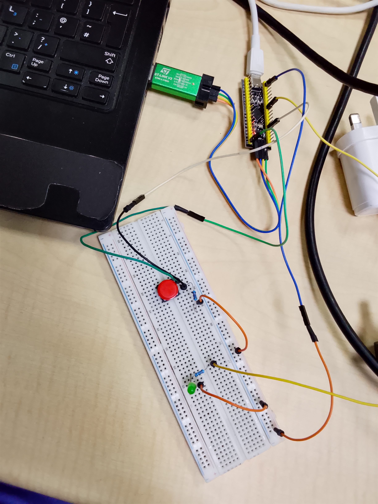

# STM32F401CCU6-Push-Button-Controlled-LED

## About This Project

This project marks my introduction to digital input interfacing using the STM32F401CCU6 microcontroller. In this project, I learned how a microcontroller reads external signals from a push button and controls an output device (LED) based on the input state.

The project was implemented using register-level programming (Bare-Metal Programming) without relying on the HAL library, helping me gain a deeper understanding of how GPIO peripherals work internally.

## Key Concepts Learned

* GPIO Input Configuration
* Pull-up and Pull-down Resistors
* Reading the Input Data Register (IDR)
* GPIO Output Control
* Register Manipulation in STM32

## Project code

[Click here to check out the project code](code)

## Project Images

## Components Used

* STM32F401CCU6 Black Pill Board
* LED ×1
* Push Button ×1
* 10kΩ Resistor ×1
* 220Ω Resistor ×1
* Breadboard and Jumper Wires

## Project Demo video

[Click here to access the project Demo video](https://youtu.be/m1ZErrZ5riI)

## What I Learned

This project strengthened my understanding of how embedded systems interact with the physical world through inputs and outputs. It also provided practical experience in configuring STM32 peripherals directly through registers, an important skill for becoming an Embedded Systems Engineer.

## Expected Result

✅ Press Button → LED Turns ON
✅ Release Button → LED Turns OFF
